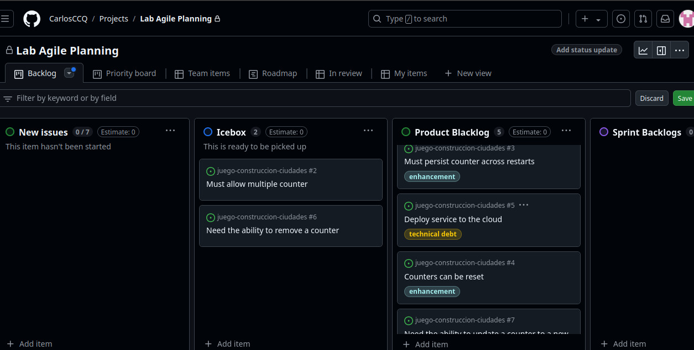
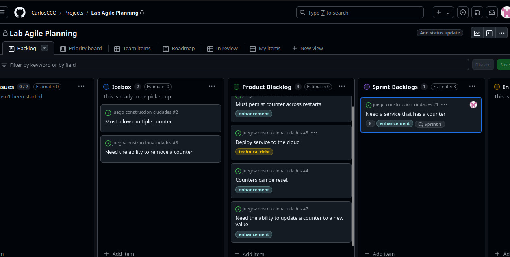

## Actividad: Gestión ágil de sprints con GitHub: planificación, ejecución y cierre de Sprints.

##### Objetivos:
* Configurar y gestionar sprints en GitHub.
* Estimar y asignar story points a las historias de usuario.
* Crear y gestionar el sprint backlog de manera efectiva.
* Seguir el flujo de trabajo diario para completar las historias.
* Configurar y analizar un burndown chart para monitorear el progreso del sprint.
* Cerrar un sprint, gestionar el trabajo incompleto y preparar el backlog para el próximo sprint.

#### Parte 1
En este ejercicio, crearás un plan de sprint a partir de tu product blacklog. Esto normalmente se hace durante la reunión de planificación del sprint con todo el equipo, asi que para este ejercicio, simularemos essa reunión.

##### Objetivos
Después de completar este ejercicio, podrás:
* Configurar sprints.
* Estimaciones a las historias.
* Asignar un sprint a las historias.
* Construir tu sprint backlog.

##### Estado inicial

Después de completar la actividad anterior tu Kandan board debería verse así:

New Issues:
* None

Icebox:
* Must allow multiple counters
* Need the ability to remove a counter

Product Backlog:
* Need a service that has a counter
* Must persist counter across restarts
* Deploy serfice to the cloud
* Counters can be rest
* Need ability to update a counter to a new value

1. <b>Configuración de Sprints</b>

En este ejercicio, configurarás, tus sprints. GitHub configurará a tres (3) sprints de forma predeterminada para que puedas comenzar. Luego, creará nuevos sprints automáticamente según sea necesario.

1.1. Ve a GitHub, inicia sesión con tu cuenta de GitHub, y abre tu Kandan board.
1.2. Para crear el sprint, haz clic en el botón desplegable junto a Backlog. Luego, haz clic en la flecha derecha junto a Fields y selecciona New field.

1.3 Aparecerá una ventana emergente. Introduce "Sprint" como el nombre del campo, elige "Iteracion" como el tipo de campo, y deja la flecha de inicio en la fecha actual. Mantén la duración en dos semanas. Finalmente, haz clic en el botón Save and create.

1.4 Ahora tienes un sprint que se puede usar para la planificación del sprint en el próximo ejercicio.

2. <b>Crear un plan Sprint</b>

En este ejercicio, crearás un sprint plan. Asignaremos puntos de historia estimados y un sprint , y moveremos las historias del Product Backlog al Sprint Backlog para construir nuestro plan.

2.1 Selecciona la historia superior "Need a service that has a counter" del Product Backlog para abrirla.

2.2 Discute la historia con el equipo, y tus desarrolladores están de acuerdo en que esta es una historia grande que vale 8 puntos de historia, así que establece el Estimado en 8.

2.3 Haz clic en "Choose an iteration" junto a Sprints y selecciona el primer sprint de la lista desplegable para asignar la historia a ese sprint. Puedes asignar una historia a más de un sprint, pero esto no es muy ágil. Si tu historia es más grande que un sprint, entonces es demasiado grande y debe dividirse en historias más pequeñas "del tamaño de un sprint".

2.4 Tu historia debería verse como la siguiente. Haz clic en la "X" para cerrar la ventana de la historia y volver al Kandan board.

2.5 El equipo de desarrollo ha determinado que agregar una historia de 8 puntos al sprint es aceptable. Arrastra la historia del Product Backlog al Sprint Backlog.
Nota: Puedes ver las fechas de inicio y fin de la historia de usuario pasando el ratón sobre el SPrint que se muestra en la tarjeta.

2.6 Tu Kanban board debería verse ahora como el siguiente. Observa que la estimación de puntos de historia y la fechas del sprint son anotaciones en la historia.

2.7 La reunión de planificación del sprint ha avanzado bien. En las discuciones con el equipo de desarrollo,  han estimado las siguientes dos historias en el Product Backlog y han determinado que ambas pueden caber en el sprint actual. Selecciona cada una de las siguientes historias en el Product Backlog, aignales los puntos de historia correspondientes y el mismo Sprint, y arrástralas al Sprint Backlog en el mismo orden.

Título de la Historia: Must persist counter across restarts. Puntos de Historia: 5
Título de la Historia: Deploy service to the cloud. Puntos de Historia: 5

Al fina de este paso, tu sprint plan debereía verse así:

2.8 Basado en velocidad del equipo, el quipo de desarrollo ha decidido que hay suficientes historias en el sprint, pero queda algo de tiempo en la reunión de planificación del sprint para estimar más historias. Añade las siguientes estimaciones a las historias en el Product Backlog.
Counters can be reset 3
Need ability to update a counter to new value 5

Al final de este ejercicio, tu Kanban board deberia verse así:

#### Parte 2
En este ejercicio, seguirás el flujo de trabajo diario de mover historias del sprint backlog a la columna In Progres, asignándolas a ti mismo para trabajar en ellas, moviéndolas a Review/QA y finalmente a la columna Done.

Después de completar este ejercicio, podrás:
* Asigar historias a ti mismo.
* Mover historias a In Progress para trabajar en ellas.
* Mover historias a Review/QA para revisión del equipo.
* Mover historias a Done una vez que se hayan completado.

##### Estado inicial

New Issues;
* Done

Icebox:
* Must allow multiple counters.
* Need the ability to remove a counter

Product BAcklog:
* Counters can be reset
* Need ability to update a counter to a new value

Sprint Backlog:
* Need a service that has a counter
* Must persist counter across restarts
* Deploy service to the cloud

1. Flujo de trabajo diario

En este ejercicio, simularás el flujo de trabajo diario de un desarrollador en un equipo Agile.
Comenzarás moviendo una historia desde la parte superior del Sprint Backlog a la columna In Progress y la asignarás a ti mismo. Luego, simularás completar la historia, solicitar un revisión y finalmente moverla a Done.

1.1 Ve a GitHub, inicia sesión con tu cuenta de GitHub y abre tu Kanban board.
1.2 El sprint ha comenzado y estás listo para trabajar en tu primera historia. Selecciona la historia en la parte superior del Sprint Backlog para abrirla y leerla
1.3 Después de leerla, decides que esta es una tarea para la que tienes las habilidades necesarias, así que te la asignas haciendo clic en la opción "Assign yourself".

1.4 Una vez asignada, haz clic en el botón "X" para cerrar la ventana.
1.5 De vuelta en el Kanban board, mueve la hsitoria que acabas de asignarte del Sprint Backlog arrastrándola a la columna In Progress.
1.6 Ahora, todos saben que estás trabajando en esta historia. Normalmente, crearías una rama en GitHub para comenzar a trabajar en tu código. Para este laboratorio, solo asegúrate de que tu Kanban board se vea como el siguiente.

1.7 Una vez que termines de trabajar en la historia, es momento de solicitar una revisión. Siempre es buena idea que al menos otra persona revise todos los productos de trabajo. Si registraste código en GitHub, este es el paso donde harías un pull request para fusionar tu código en la rama main. Mueve tu historia de In Progress a Review/QA.

1.8 Mientras esperas una revisión, decides comenzar a trabajar con otra historia. Toma la siguiente historia de la parte superior del Sprint Backlog, léela para asegurarte de que tienes las habilidades para impelmentarla, asignatela y muévela a In Progress.

1.9 Tu pull request para la historia inicial ha sido aprobada, y el proceso de revisión se ha completado. Por favor, mueve la historia "Need a service that has a counter" de la columna Review/QA a la columna Done.
Nota: Cuando los issues se mueven a la columna Done

1.10 Haz completado el trabajo en tu segunda historia y has hecho otro pull request. Mueve la historia "Must persist counter across restarts" de la columna In Progress a la columna Review/QA para solicitar una revisión.

1.11 Toma la última historia, "Deploy service to the cloud", de la parte superior del Sprint Backlog, asignatela y muévela a In Progress.

1.12 La revisión de tu segunda historia se ha completado. Mueve la historia "Must persist counter across restarts" de Review/QA a Done.

1.13 El sprint ha terminado y no hemos tenido tiempo para completar nuestra última historia, "Deploy service to the cloud", que aún está en progreso. Veremos cómo lidear con esto.
Déjala donde está por ahora.

El Kanban board terminado para este ejercicio debería verse así:

#### Parte 3

En este ejercicio, configurarás un burndown chart para tu sprint plan usando GitHub. Un burndown chart es un herramienta visual utilizada en el gestión ágil del proyecto para rastrear el progreso de un proyecto a lo largo del tiempo. Muestra la cantidad de trabajo restante frente al tiempo. El eje x es un burndown chart normalmente reprenta la linea de tiempo (días, sprints, etc.), mientras que el eje muestra la canitdad de trabajo restante (a menudo medido en story points, tareas u horas). El gráfico ayuda a los equipos a monitorear su progreso y predecir su completarán su trabaja antes de la fecha limite del proyecto.

##### Objetivos

Después de completar este laboratorio, podrás:

* Entender cómo configurar tu burndown chart
* Ver los datos que contiene un burndown chart
* Evaluar tu progreso en el sprint

1. Configurar tu Burndown Chart

En este ejercicio, configurarás tu burndown chart para mostrar el estado de las historias en el columna Don.

1.1 Ve a Github, inicia sesión con tu cuenta y abre tu Kanban board.

1.2 Para crear un burndown chart para tu sprint en GitHub Projects, haz clic en el menú desplegable junto a Backlog y selecciona Generate chart.

1.3 Esta acción abrirá la sección Insights de tu proyecto. Aquí, verás el gráfico de Status predeterminado generado para tu proyecto.

1.4 PAra configurar un burndown chart que solo muestre el estado de las historias en la columna Done en lugar del gráfico predeterminado, aplica un filtro. Haz clic en Gilter by Keyword or field, escirbe "Status" y selecciona "status:" del menu deplegable. Esto mostrará otro menú desplegable con todas las columnas de tu Kanban board. Selecciona "Done".

1.5 Al pasar el cursor sobre el gráfico, puedes ver el número de hsitorias de usuario en la columna Done. Estas incluyen las dos historias, "Need a service that has a counter" y "Must persist counter across restat", que moviste a Done en el ejercicio anterior.

1.6 A continuación, para crear un nuevo gráfico que muestre el número de story points completados y restantes el sprint, comienza limpiando el filtro haciendo clic en el botón clear filter. Luego, haz clic en el botón Configure, como se muestra en la captura de pantalla a continuación. Esto proporcionará un indicador visual de tu progreso.

1.7 Para configurar el gráfico, añade los siguiente detalles:

* Layout: Selecciona "Column" de las opciones de layout.
* X-axis: Configura el eje X en "Sprint"
* Group by: Elige "Status" para agrupar los datos por estado.
* Y-axis: Confgura el eje Y en "Sum of a field".
* Y-axis field: Elige "Estimate" como el campo a sumar.

1.8 Para centrar el gráfico en un sprint especifico, usa la opción de filtro. Escribe "sprint:" en el cuadro de filtro y selecciona el sprint como "Sprint 1". Nota: "sprint 1" se refiere a la primera iteración del sprint que asignamos a las historias.

1.9 Al pasar el ratón sobre la columna Done, se mostrará el número de story points completados en el sprint, mientras que al pasar el ratón sobre la columna Progress se mostrará el número de story points restantes en el sprint. Esto proporcionara un indicador visual útil de tu progreso. El burndown chart te permite evaluar rápidamente qué historias se han completado y cuáles aún requieren trabajo.

Nota: Para obtener información más detallada sobre tu proyecto, puedes personalizar las opciones del eje x, el eje y y la agrupación según tus requisitos especificos. Además, tienes la flexibilidad de modificar el layout del gráfico para visualizar mejor los datos. Al ajustar estas configuraciones, puedes crear representaciones más significativas e informativas con tus objetos de análisis.

#### Parte 4

En este ejercicio práctico, aprenderás las actividades esenciales de cierre de sprint utlizando GitHub para gestionar historias no terminadas y preparar el backlog para el próximo sprint. Ajustarás los story points para las tareas imcompletas, moverás las historias a la columna "Done" y continuidad fluidas entre sprints.

##### Objetivos

Después de completar este ejercicio, podrás:

* Ajustar los story points para reflejar con precisón el esfuerzo realizado.
* Gestionar issues y columnas en GitHub para rastrear el progreso del sprint.
* Crear nuevos issues para documentar deuda técnica y trabajo no terminado.
* Organizar el product backlog para priorizar y planificar de manera efectiva el próximo sprint.

Nota: En el Kanban board, no tenemos una columna "Closed" porque, en GitHub, cuando movemos issues a la columna "Done", se cierran automáticamente gracias a la funcionalidad incorporda de GitHub.

1. Gestionar el trabajo incompleto

En este ejercicio, gestionarás las historias no terminadas en el sprint. Estas son historias que el equipo ha comenzado, pero no ha completado. Queremos ajustar la estimación para contabilizar los story points gastados, de modo que se refleje en la velocidad del equipo, y crear una nueva historia para finalizar el trabajo en el próximo sprint.

1.1 Selecciona la historia "Deploy service to the cloud" en la columna In Progress para abrirla.

1.2 Haz clic en la opción "Estimate".

1.3 El desarrollo ha determinado que no se gastaron 5 story points de esfuerzo en esta historia y simplemente se quedaron sin tiempo. Estiman que se gstaron 2 story points. Introduce "2" en el campo de texto para cambiar los story points. Ahora podemos ver que los story points están configurados en 2. Luega, haz clic en la "X" para cerrar la ventana.
1.4 Ahora los story points se han ajustado para reflejar el esfuerzo que se hixo en este sprint. Mueve esta hsitoria a la columna Done.
1.5 Tu Kanban board ahora se parecerá a la capturaa de pantalla que se muestra a continuación:

1.6 Queremos crear una nueva historia para documentar el trabajo restante. Regrese a tu repositorio de GitHub de la actividad. Navega a la pestaña Issues y haz clic en el botón "New Issue". Nota: Elige la "User Story Template" y haz clic en el botón "Get Started".
1.7 Completa el nuevo issue llenando el título y la descripción para completar la historia, como se muestra en la captura de pantalla a continuación. Asigna la etiqueta "technical debt", simialr a la historia original. Elige el proyecto como "Lab Agile Planning". Una vez temrinado, haz clic en el botón "Submit new issue".

1.8 Dado que este nuevo issue se agregará a la columna Product Backlog, abre la lista desplegable junto a la opción Status y elige "Product Backlog". Establece el Estimate en "3", representando los story points restantes de la historia no terminada.

1.9 Asegúrate de que la historia esté en la parte superior de la columna Product Backlog para ser seleccionada en el próximo sprint

Resumen

En esta actividad, aprendiste las habilidades necesarias para cerrar un sprint de manera efectiva utilziando GitHub, asegurando que todas las tareas se contabilicen adecuadamente y que el backlog se refine para futuras iteraciones. Al dominar estas actividades de fin de sprint, mejorarás la agilidad de tu equipo y agilizarás el proceso de transición de sprint, lo que contribuirá en última instancia a mejorar la eficiencia en la gestión de proyectos y la entrega.